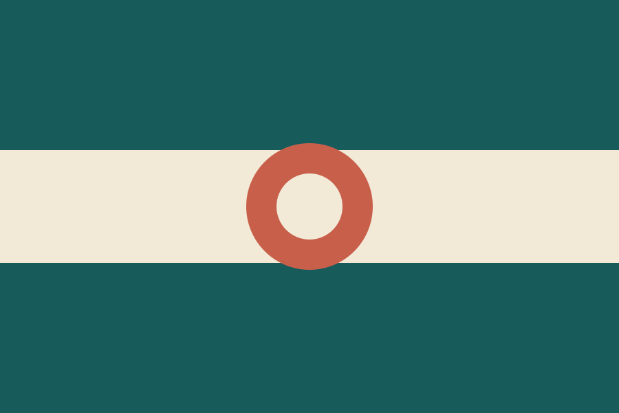

```{=html}
<main class="portal-shell" aria-labelledby="portal-title">
  <header class="portal-header">
    <p class="eyebrow">BA2 European Politics and Society</p>
    <h1 id="portal-title">Groningen Democracy Observatory</h1>
    <p class="portal-intro">Choose a country case to open its institutional dashboard. Each case contains a twenty-year trajectory and a country brief.</p>
  </header>

  <section class="country-grid" aria-label="Country cases">
    <a class="country-card country-card--entopia" href="entopia/">
      
      <span class="country-card__copy">
        <span class="country-card__kicker">Country case</span>
        <strong>Entopia</strong>
        <span>Open dashboard <span aria-hidden="true">→</span></span>
      </span>
    </a>

    <a class="country-card country-card--moreland" href="moreland/">
      
      <span class="country-card__copy">
        <span class="country-card__kicker">Country case</span>
        <strong>Moreland</strong>
        <span>Open dashboard <span aria-hidden="true">→</span></span>
      </span>
    </a>

    <a class="country-card country-card--govistan" href="govistan/">
      
      <span class="country-card__copy">
        <span class="country-card__kicker">Country case</span>
        <strong>Govistan</strong>
        <span>Open dashboard <span aria-hidden="true">→</span></span>
      </span>
    </a>
  </section>

  <aside class="portal-note">
    <strong>Course use</strong>
    <span>All country names, descriptions, and observations in this environment are synthetic. The dashboard does not classify the regime or select indicators for you.</span>
  </aside>
</main>
```
